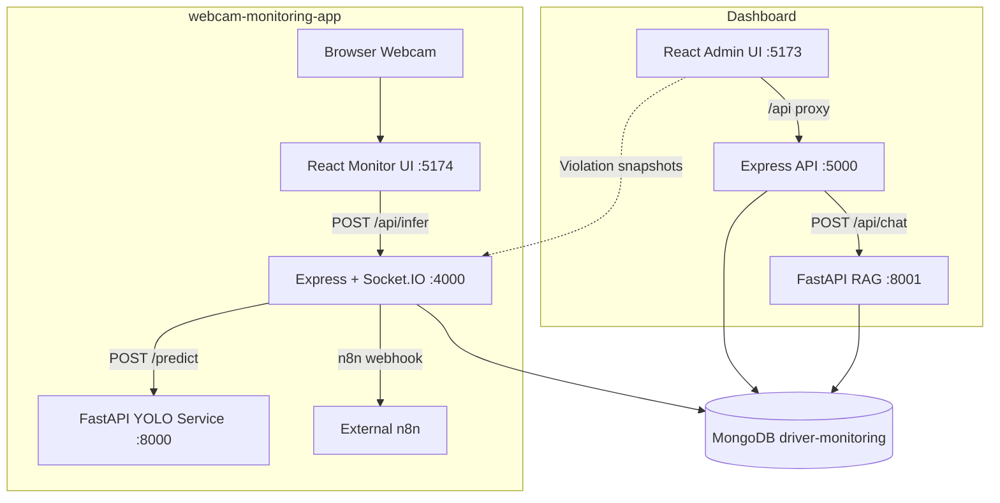
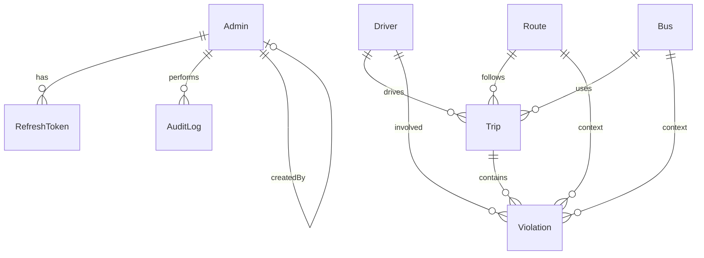
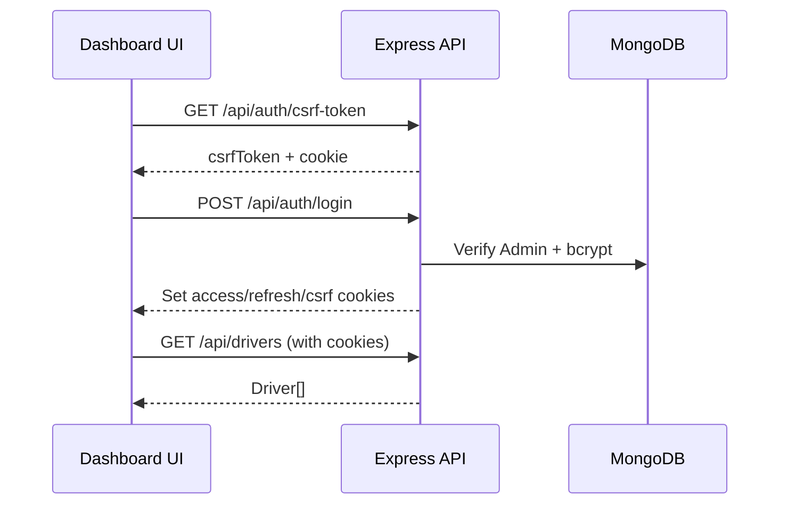
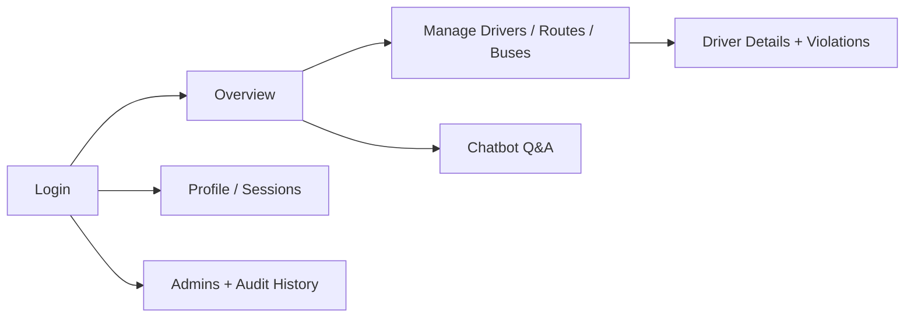

# Driver Monitoring System

> Enterprise-grade fleet safety platform combining real-time computer-vision monitoring, operational dashboards, and AI-powered analytics over trip and violation data.

---

## Overview

The **Driver Monitoring System (DMS)** is a multi-service application designed to improve road safety for bus and fleet operators. It captures live webcam frames from the driver cabin, runs specialized YOLO-based models to detect risky behaviors, persists violations and trips to MongoDB, and presents fleet administrators with a secure web dashboard for oversight, management, and natural-language insights.

### Problem Statement

Fleet operators need continuous visibility into driver behavior—drowsiness, distraction, smoking, seat-belt compliance, and phone use—without relying solely on manual review. Incidents must be logged with evidence, tied to drivers and trips, and surfaced to supervisors in near real time.

### Purpose

This system provides:

1. **Live detection** — Automated inference on webcam frames during active trips.
2. **Centralized records** — Drivers, routes, buses, trips, violations, and snapshots in one database.
3. **Administrative control** — Role-based dashboard for fleet CRUD, security, and audit history.
4. **Intelligent Q&A** — A RAG (Retrieval-Augmented Generation) chatbot over trip data using vector search and Groq LLM.

### Goals

- Reduce unsafe driving through automated, confidence-thresholded alerts.
- Give supervisors actionable dashboards (counts, charts, violation galleries).
- Maintain accountability via audit logs, session management, and optional n8n webhook alerts.
- Enable operators to ask questions about fleet performance in plain language.

---

## System Description

End-to-end, the platform works as follows:



1. An operator starts a **trip** in the webcam app (driver required; route and bus optional).
2. While the trip is active, the browser captures frames on a configurable interval and sends them to the webcam backend.
3. The backend forwards each frame to the **AI service**, which runs five YOLO models in parallel (smoking, drowsiness, seat belt, cellphone, steering).
4. When detections exceed configured confidence thresholds and pass per-type cooldowns, the backend saves a **Violation** document, writes a PNG snapshot, decrements the trip **score**, and optionally forwards an alert to **n8n**.
5. **Socket.IO** pushes live status and `eventSaved` updates to the monitor UI.
6. Administrators use the **Dashboard** to manage fleet entities, review violations (including images served from the webcam backend), and query trip intelligence via the **RAG chatbot**.

Both applications share the same MongoDB database (`driver-monitoring` by default).

---

## Features

Features below are grouped by category. Only functionality present in the codebase is listed.

### 🔐 Authentication & Authorization

| Feature | Description |
|---------|-------------|
| JWT in httpOnly cookies | Access token (`access_token`, ~15m) and refresh token (`refresh_token`, ~7d, path `/api/auth`). |
| Bearer fallback | `Authorization: Bearer <token>` supported by `authenticate` middleware. |
| CSRF protection | Double-submit cookie (`csrf_token`) + `X-CSRF-Token` header on mutating requests (login/CSRF fetch exempt). |
| Role-based access | `SUPER_ADMIN` and `ADMIN`; super-admin-only routes for admin management and audit history. |
| Account lockout | Failed login attempts tracked; HTTP **423** when locked (`LOCKOUT_MAX_ATTEMPTS`, `LOCKOUT_DURATION_MS`). |
| Password policy | Complexity rules, bcrypt hashing, password history (`PASSWORD_HISTORY_COUNT`). |
| Session management | List sessions, revoke one, revoke all others, logout all devices. |
| Refresh token rotation | Family-based rotation with reuse detection (revokes family on reuse). |
| Super admin seeding | Auto-created on Dashboard backend startup from env vars. |

### 📊 Dashboard & Analytics

| Feature | Description |
|---------|-------------|
| Overview page | Live counts for drivers, routes, buses; fleet average score; violation breakdown pie chart (from `/api/violations`). |
| Safety score history chart | Uses **static mock data** (`mockData.js`), not live API. |
| Notifications panel | Uses **static mock data**, not live API. |
| Stat cards | Driver/route/bus counts and metrics from API where noted above. |
| Recharts visualizations | Area and pie charts on overview. |

### 👤 Driver Management

| Feature | Description |
|---------|-------------|
| List / create / edit / delete | Full CRUD via `/api/drivers`; auto-generated `DRV-NNN` IDs on create. |
| Driver details | Profile, trip history with populated route, bus, and violations. |
| Violation image slider | Loads snapshot URLs from webcam backend (`VITE_WEBCAM_BACKEND_URL`). |
| Score badges | Visual score display from `avgScore` field. |

### 🚌 Fleet Resources

| Feature | Description |
|---------|-------------|
| Routes CRUD | Name-based route management (`/api/routes`). |
| Buses CRUD | Capacity 27 or 50; auto `BUS-NNN` IDs (`/api/buses`). |
| Trips API | List trips (limit 100), get trip by ID (`/api/trips`) — **no dedicated trips page in router** (mock-only `TripsPage` exists but is unwired). |

### ⚠️ Violations & Monitoring

| Feature | Description |
|---------|-------------|
| Violation types (DB) | `cigarettes`, `vape`, `drowsy`, `cellphone`, `no_belt`. |
| Violation listing | Filter by `type`, `tripId`, `driverId` (`/api/violations`, max 200). |
| Snapshot storage | PNG files under `webcam-monitoring-app/storage/snapshots/<type>/`. |
| Trip scoring | Starts at 100; −10 per saved violation (floor 0). |
| Live monitor UI | Five detection indicators + last-event timestamps. |
| Cooldowns | Per-type `EVENT_COOLDOWN_MS` to reduce duplicate events. |
| Rate limiting | `/api/infer` limited by `INFER_RATE_LIMIT_PER_MIN`. |

### 🔔 Alerts & Integrations

| Feature | Description |
|---------|-------------|
| n8n webhooks | Optional `N8N_WEBHOOK_URL`; payload includes type, confidence, driver/route/bus names, trip ID, image path. |
| Manual alert endpoint | `POST /api/alerts/violation` forwards payloads without running detection. |
| Alert gating | `ALERT_ENABLED`, `ALERT_MIN_CONFIDENCE`. |

### 🤖 AI / ML

| Feature | Description |
|---------|-------------|
| YOLO inference (webcam) | Five Ultralytics models: smoking, drowsiness, belt, cellphone, steering (classification). |
| Parallel inference | `ThreadPoolExecutor` with 5 workers in AI service. |
| RAG chatbot | Four-agent pipeline: Query → Retriever → Analysis → Response (Groq LLM). |
| Vector search | Sentence-transformers embeddings + MongoDB Atlas Vector Search on trips. |
| Auto-embedding | MongoDB change stream watches trips and embeds on insert/end. |
| Conversational memory | Optional session memory in RAG service (`ENABLE_MEMORY`). |

### 🛡️ Security & Compliance

| Feature | Description |
|---------|-------------|
| Helmet | HTTP security headers (CSP in production). |
| CORS | Credentials-enabled, origin from `CLIENT_URL` / `FRONTEND_ORIGIN`. |
| Input sanitization | `express-mongo-sanitize`, custom `sanitizeInput` middleware. |
| Global rate limit | 500 requests / 15 min (Dashboard API). |
| Audit log | Immutable security events; CSV export for super admins. |
| Audit actions | Login, logout, password changes, admin CRUD, lockout, token reuse, etc. |

### 🧪 Testing

| Feature | Description |
|---------|-------------|
| Backend Jest tests | Auth, lockout, RBAC (`backend/tests/`). |
| Frontend Vitest | `apiClient` response unwrapping test. |

### ⚙️ Known Gaps (documented from code)

- **`hands_off_wheel`**: Detected in `inferController.js` but **not** in `Violation` schema enum or `eventLogger` `EVENT_TYPES` — persistence would throw at runtime if triggered.
- **Trips UI**: `TripsPage` / `TripDetailsPage` use mock data and are **not** registered in `App.jsx`.
- **Overview mock sections**: Notifications and safety score history are not API-driven.
- **RAG sessions**: Chatbot does not send `session_id`; memory is unused from the UI.
- **`/api/logs/:type`**: Only accepts `cigarettes`, `vape`, `drowsy` (not `cellphone` / `no_belt`).
- **`/api/status`**: Omits `belt`, `cellphone`, `steering` in HTTP response (Socket.IO includes them).

---

## Tech Stack

### Frontend (Dashboard)

| Technology | Version / Notes |
|------------|-----------------|
| React | 18.3 |
| Vite | 7.x |
| React Router | 6.x |
| Tailwind CSS | 3.4 |
| Radix UI | Multiple primitives |
| Recharts | 2.x |
| Axios | via `apiClient` |
| React Hook Form + Zod | Forms / validation |
| Sonner | Toast notifications |
| Lucide React | Icons |
| Vitest + Testing Library | Unit tests |

### Frontend (Webcam App)

| Technology | Version / Notes |
|------------|-----------------|
| React | 18.3 |
| Vite | 5.x (port **5174**) |
| Tailwind CSS | 3.4 |
| Socket.IO Client | 4.8 |

### Backend (Dashboard)

| Technology | Version / Notes |
|------------|-----------------|
| Node.js / Express | 4.21 |
| Mongoose | 8.9 |
| JWT (`jsonwebtoken`) | Cookie + Bearer auth |
| bcryptjs | Password hashing |
| Helmet, CORS, rate-limit | Security middleware |
| express-validator | Request validation |
| Jest + Supertest | API tests |

### Backend (Webcam App)

| Technology | Version / Notes |
|------------|-----------------|
| Express | 4.19 |
| Socket.IO | 4.8 |
| Mongoose | 8.23 |
| Axios | AI service client |
| Sharp | PNG snapshots |
| express-rate-limit | Infer endpoint |

### AI Services

| Service | Stack | Port (default) |
|---------|-------|----------------|
| YOLO inference | FastAPI, Ultralytics, OpenCV, Pillow | **8000** |
| RAG pipeline | FastAPI, Groq, sentence-transformers, PyMongo | **8001** |

### Database

| Technology | Usage |
|------------|-------|
| MongoDB | Shared `driver-monitoring` database |
| Atlas Vector Search | Trip embeddings for RAG (index name configurable) |

### Tools

| Tool | Usage |
|------|-------|
| concurrently | Run multi-service dev stacks |
| nodemon | Dashboard backend hot reload |
| n8n | Optional external alert workflows (`docs/n8n-workflow.json`) |

---

## System Architecture

The repository contains **two independently runnable applications** that integrate through **shared MongoDB** and optional cross-origin snapshot URLs.

| Layer | Dashboard | Webcam App |
|-------|-----------|------------|
| Presentation | React SPA (admin) | React SPA (operator monitor) |
| API | Express REST + cookie auth | Express REST + Socket.IO |
| Intelligence | RAG service (Groq + embeddings) | YOLO inference service |
| Persistence | MongoDB | MongoDB + local snapshot files |

**Communication patterns:**

- Dashboard frontend → Dashboard API via Vite proxy (`/api` → `localhost:5000`).
- Webcam frontend → Webcam API directly (`VITE_BACKEND_URL`, default `localhost:4000`).
- Webcam API → AI service (`AI_SERVICE_URL`, default `localhost:8000`).
- Dashboard API → RAG service (`RAG_URL`, default `localhost:8001`).
- Dashboard violation images → Webcam static server (`/storage/...` on port 4000).

There is **no WebSocket layer in the Dashboard**; real-time updates exist only in the webcam application.

---

## Project Structure

```
Driver-monitoring-system/
├── README.md                          # This file
├── package.json                       # Legacy root scripts (frontend-only stub)
├── public/                            # Static assets (robots.txt, placeholder.svg)
│
├── Dashboard/                         # Admin dashboard + RAG
│   ├── package.json                   # dev: RAG + API + UI (concurrently)
│   ├── backend/
│   │   ├── server.js                  # Entry: MongoDB + listen
│   │   ├── seed.js                    # Fleet data seeding utility
│   │   ├── .env.example
│   │   ├── models/                    # Fleet Mongoose models
│   │   │   ├── Driver.js
│   │   │   ├── Trip.js
│   │   │   ├── Bus.js
│   │   │   ├── Route.js
│   │   │   └── Violation.js
│   │   ├── routes/                    # Legacy fleet REST routers
│   │   ├── src/
│   │   │   ├── app.js                 # Express application wiring
│   │   │   ├── config/                # Centralized env config
│   │   │   ├── middlewares/           # auth, csrf, sanitize, errors
│   │   │   ├── models/                # Admin, RefreshToken, AuditLog
│   │   │   ├── modules/               # auth, admins, history
│   │   │   ├── services/              # tokens, sessions, audit, passwords
│   │   │   ├── seed/                  # Super admin bootstrap
│   │   │   └── utils/
│   │   ├── RAGagent/                  # Python FastAPI RAG service
│   │   │   ├── server.py
│   │   │   ├── rag_pipeline.py
│   │   │   ├── agents.py
│   │   │   ├── embedding_generator.py
│   │   │   └── requirements.txt
│   │   └── tests/                     # Jest integration tests
│   └── frontend/
│       ├── src/
│       │   ├── api/                   # drivers, buses, routes API modules
│       │   ├── contexts/              # AuthContext
│       │   ├── features/              # Page-level feature modules
│       │   ├── layout/                # AppLayout, sidebar, topbar
│       │   ├── routes/                # ProtectedRoute, RoleRoute
│       │   ├── services/              # apiClient, auth, admins, history
│       │   ├── shared/components/     # Reusable UI
│       │   └── data/mockData.js       # Static demo data
│       └── vite.config.js             # Proxies /api → :5000
│
└── webcam-monitoring-app/             # Live monitoring stack
    ├── package.json                   # dev: AI + API + UI
    ├── backend/
    │   ├── src/
    │   │   ├── index.js               # Express + Socket.IO bootstrap
    │   │   ├── config/env.js
    │   │   ├── controllers/           # infer, health, trips, logs, etc.
    │   │   ├── models/                # Violation, Trip, shared fleet models
    │   │   ├── routes/alerts.js
    │   │   └── services/              # aiClient, eventLogger, alerts, cooldown
    │   └── .env.example
    ├── frontend/
    │   └── src/
    │       ├── pages/WebcamMonitorPage.jsx
    │       ├── components/StatusPanel.jsx
    │       └── lib/                   # api.js, socket.js
    ├── ai-service/
    │   ├── app/
    │   │   ├── main.py
    │   │   ├── config.py
    │   │   ├── inference/             # YOLO loaders + predictors
    │   │   └── utils/image_utils.py
    │   ├── models/                    # Expected .pt weight files (not in repo)
    │   └── requirements.txt
    ├── storage/
    │   ├── snapshots/                 # Runtime violation images
    │   └── logs/                      # Legacy JSON logs (unused by current code)
    └── docs/                          # n8n setup, sample payloads
```

### Folder Purposes

| Path | Purpose |
|------|---------|
| `Dashboard/backend/models` | Fleet domain schemas used by legacy `/api/*` routes. |
| `Dashboard/backend/src/models` | Security domain: admins, refresh tokens, audit logs. |
| `Dashboard/backend/src/modules` | Feature modules with routes, controllers, services, validators. |
| `Dashboard/backend/RAGagent` | Standalone Python service for embeddings + chat. |
| `webcam-monitoring-app/ai-service` | GPU/CPU YOLO inference microservice. |
| `webcam-monitoring-app/storage` | Durable snapshot storage served over HTTP. |

---

## Database Structure

### Entity Relationship Diagram



### Models

#### `Driver` (collection: `drivers`)

| Field | Type | Notes |
|-------|------|-------|
| `id` | String | Business ID, e.g. `DRV-001` (unique) |
| `name` | String | Required |
| `avgScore` | Number | 0–100, default 0 |
| `totalTrips` | Number | Updated when trips stop |
| `createdAt`, `updatedAt` | Date | Timestamps |

#### `Route` (collection: `routes`)

| Field | Type | Notes |
|-------|------|-------|
| `name` | String | Required |
| timestamps | Date | |

#### `Bus` (collection: `buses`)

| Field | Type | Notes |
|-------|------|-------|
| `busId` | String | e.g. `BUS-001` (unique) |
| `capacity` | Number | Enum: **27** or **50** |
| timestamps | Date | |

#### `Trip` (collection: `trips`)

| Field | Type | Notes |
|-------|------|-------|
| `driver` | ObjectId → Driver | Required |
| `route`, `bus` | ObjectId | Optional |
| `startTime`, `endTime` | Date | `endTime` set on stop |
| `active` | Boolean | Default `true` |
| `score` | Number | 0–100, default 100 |
| `violations` | [ObjectId → Violation] | |
| `embedding`, `trip_summary` | — | Used by RAG Python layer (not in JS schema) |

#### `Violation` (collection: `violations`)

| Field | Type | Notes |
|-------|------|-------|
| `type` | String | `cigarettes`, `vape`, `drowsy`, `cellphone`, `no_belt` |
| `confidence` | Number | |
| `timestamp` | Date | |
| `imagePath` | String | Relative path under `storage/snapshots/` |
| `source` | String | Default `webcam` |
| `model` | String | e.g. `smoking-model` |
| `driver`, `route`, `bus`, `trip` | ObjectId | Optional refs |

**Indexes:** `{ trip, timestamp }`, `{ type, timestamp }`.

#### `Admin` (collection: `admins`)

| Field | Type | Notes |
|-------|------|-------|
| `username`, `email` | String | Unique |
| `password` | String | Select: false, bcrypt |
| `role` | String | `SUPER_ADMIN` \| `ADMIN` |
| `isActive`, `avatar`, `lastLogin` | — | |
| `failedLoginAttempts`, `lockUntil` | — | Lockout |
| `createdBy` | ObjectId → Admin | |

#### `RefreshToken` (collection: `refreshtokens`)

| Field | Type | Notes |
|-------|------|-------|
| `admin` | ObjectId | |
| `tokenHash`, `familyId` | String | Rotation family |
| `expiresAt`, `revokedAt`, `replacedByTokenHash` | Date/String | |
| `ip`, `userAgent`, `deviceLabel`, `lastUsedAt` | — | Session metadata |

#### `AuditLog` (collection: `auditlogs`)

| Field | Type | Notes |
|-------|------|-------|
| `actor`, `actorUsername` | — | |
| `action` | String | From `AUDIT_ACTIONS` enum |
| `severity`, `isSecurityEvent` | — | |
| `targetType`, `targetId`, `entityLink`, `metadata` | — | |
| `ip`, `userAgent`, `createdAt` | — | |

### Data Flow

1. **Violation creation** (webcam): `infer` → `eventLogger.saveEvent` → MongoDB `violations` + file on disk → update `trips.violations` + decrement `trips.score`.
2. **Trip stop** (webcam): Recompute driver `avgScore` and `totalTrips` from all trips.
3. **Dashboard read**: Authenticated admins query fleet and violation endpoints; overview aggregates client-side.
4. **RAG embedding** (Python): Change stream on `trips` triggers `embed_trip_by_id` for vector search.

---

## API Documentation

### Conventions

| API area | Base URL | Auth | Response shape |
|----------|----------|------|----------------|
| Dashboard auth/admin/history | `http://localhost:5000` | Cookies + CSRF | `{ success, data?, error?, details? }` |
| Dashboard fleet | `http://localhost:5000/api` | Cookie/Bearer + CSRF on mutations | Raw JSON / `{ error }` |
| Dashboard chat proxy | `POST /api/chat` | Authenticated | Passthrough from RAG |
| RAG service | `http://localhost:8001` | None (dev) | `{ answer, intent, source, doc_count, total_ms, session_id? }` |
| Webcam backend | `http://localhost:4000` | None | `{ success, ... }` or plain objects |
| AI service | `http://localhost:8000` | None | `{ success, smoking, drowsiness, belt, cellphone, steering }` |

---

### Dashboard API — Health

#### `GET /health`

| | |
|---|---|
| **Auth** | None |
| **Response** | `{ "success": true, "data": { "status": "ok" } }` |

---

### Dashboard API — Authentication (`/api/auth`)

#### `GET /api/auth/csrf-token`

Returns CSRF token and sets `csrf_token` cookie.

**Response `data`:** `{ "csrfToken": "<token>" }`

---

#### `POST /api/auth/login`

| | |
|---|---|
| **Rate limit** | 15 / 15 min |
| **CSRF** | Exempt |

**Body:**
```json
{
  "identifier": "superadmin",
  "password": "SuperAdmin@123!"
}
```
(`identifier` accepts username or email.)

**Success `data`:**
```json
{
  "admin": {
    "id": "...",
    "username": "superadmin",
    "email": "superadmin@drivermonitor.local",
    "role": "SUPER_ADMIN",
    "isActive": true
  },
  "csrfToken": "..."
}
```
Sets `access_token`, `refresh_token`, `csrf_token` cookies.

**Errors:** `401` invalid credentials, `403` deactivated, `423` locked.

---

#### `POST /api/auth/refresh`

| | |
|---|---|
| **Auth** | `refresh_token` cookie |
| **CSRF** | Required |

**Response `data`:** `{ "admin": { ... } }` (rotated tokens)

---

#### `POST /api/auth/logout`

| | |
|---|---|
| **Auth** | Required |
| **CSRF** | Required |

**Response `data`:** `{ "message": "Logged out successfully" }`

---

#### `POST /api/auth/logout-all`

Revokes all refresh tokens for the user.

**Response `data`:** `{ "message": "All sessions revoked" }`

---

#### `GET /api/auth/me`

**Response `data`:** `{ "admin": { ... } }`

---

#### `GET /api/auth/sessions`

**Response `data`:**
```json
{
  "sessions": [
    {
      "id": "...",
      "deviceLabel": "Chrome on Windows",
      "ip": "127.0.0.1",
      "userAgent": "...",
      "createdAt": "...",
      "lastUsedAt": "...",
      "expiresAt": "...",
      "isCurrent": true
    }
  ]
}
```

---

#### `DELETE /api/auth/sessions/:sessionId`

**Response `data`:** `{ "message": "Session revoked" }`

---

#### `POST /api/auth/sessions/revoke-others`

**Response `data`:** `{ "revokedCount": 2 }`

---

#### `PUT /api/auth/password`

**Body:**
```json
{
  "currentPassword": "old",
  "newPassword": "NewSecure@Pass1"
}
```

**Response `data`:** `{ "message": "Password updated. Please log in again." }`

---

### Dashboard API — Admins (`/api/admins`)

All routes require authentication. Routes below also require **`SUPER_ADMIN`** except profile routes.

#### `GET /api/admins/profile` · `PUT /api/admins/profile`

Any authenticated admin. **PUT body:** `{ "username?", "email?", "avatar?" }` (avatar URL or `null`).

---

#### `GET /api/admins`

**Query:** `page`, `limit`, `search`, `role`, `status` (`active` \| `inactive`)

**Response `data`:**
```json
{
  "items": [ { "id": "...", "username": "...", "role": "ADMIN", ... } ],
  "pagination": { "page": 1, "limit": 20, "total": 5, "pages": 1, "hasNext": false, "hasPrev": false }
}
```

---

#### `GET /api/admins/:id`

**Response `data`:** `{ "admin": { ... } }`

---

#### `POST /api/admins`

**Body:**
```json
{
  "username": "fleetadmin",
  "email": "admin@example.com",
  "password": "Secure@Pass1",
  "role": "ADMIN"
}
```

---

#### `PUT /api/admins/:id`

**Body:** `{ "username?", "email?", "role?", "isActive?" }`

---

#### `DELETE /api/admins/:id`

**Response `data`:** `{ "message": "..." }`

---

#### `PATCH /api/admins/:id/status`

Toggles `isActive`.

---

#### `POST /api/admins/:id/reset-password`

**Body:** `{ "newPassword": "Secure@Pass1" }`

---

### Dashboard API — Audit History (`/api/history`)

**Requires:** `SUPER_ADMIN`

#### `GET /api/history`

**Query:** `page`, `limit`, `search`, `action`, `severity`, `securityOnly`, `from`, `to`, `actorId`

**Response `data`:** `{ "items": [...], "pagination": {...} }`

#### `GET /api/history/export`

Same filters; returns **`text/csv`** attachment (not JSON envelope).

---

### Dashboard API — Fleet (authenticated, `/api`)

#### Drivers — `/api/drivers`

| Method | Path | Body | Response |
|--------|------|------|----------|
| GET | `/` | — | `Driver[]` |
| GET | `/:id` | — | Driver document |
| POST | `/` | `{ "name": "John Doe" }` | `201` Driver (`id` auto-generated) |
| PUT | `/:id` | `{ "id": "DRV-001", "name": "John" }` | Updated Driver |
| DELETE | `/:id` | — | `{ "message": "..." }` |
| GET | `/:id/trips` | — | Trip[] with populated route, bus, violations |

---

#### Routes — `/api/routes`

| Method | Path | Body | Response |
|--------|------|------|----------|
| GET | `/` | — | `Route[]` |
| GET | `/:id` | — | Route |
| POST | `/` | `{ "name": "Route A" }` | `201` Route |
| PUT | `/:id` | `{ "name": "Route B" }` | Updated Route |
| DELETE | `/:id` | — | `{ "message": "..." }` |

---

#### Buses — `/api/buses`

| Method | Path | Body | Response |
|--------|------|------|----------|
| GET | `/` | — | `Bus[]` |
| POST | `/` | `{ "capacity": 50 }` | `201` Bus (`busId` auto) |
| PUT | `/:id` | `{ "capacity": 27 }` | Updated Bus |
| DELETE | `/:id` | — | `{ "message": "..." }` |

---

#### Trips — `/api/trips`

| Method | Path | Response |
|--------|------|----------|
| GET | `/` | Up to 100 trips (populated driver, route, bus) |
| GET | `/:id` | Trip + populated violations |

---

#### Violations — `/api/violations`

| Method | Path | Query | Response |
|--------|------|-------|----------|
| GET | `/` | `type`, `tripId`, `driverId` | Up to 200 violations (populated refs) |

---

### Dashboard API — Chat Proxy

#### `POST /api/chat`

| | |
|---|---|
| **Auth** | Required |

**Body:** `{ "query": "Which driver had the most violations last week?" }`

**Response (passthrough from RAG):**
```json
{
  "answer": "Direct Answer: ... Supporting Details: ... Explanation: ...",
  "intent": "aggregation",
  "source": "vector_search",
  "doc_count": 3,
  "total_ms": 1240.5,
  "session_id": null
}
```

---

### RAG Service (`http://localhost:8001`)

#### `GET /health`

```json
{ "status": "ok" }
```

#### `POST /query`

**Body:** `{ "query": "string", "session_id": "optional-uuid" }`

**Response:** Same shape as chat proxy above.

#### `DELETE /session/{session_id}`

```json
{ "status": "cleared", "session_id": "..." }
```

---

### Webcam Backend (`http://localhost:4000`)

#### `GET /api/health`

```json
{
  "ok": true,
  "aiServiceReachable": true,
  "timestamp": "2026-05-23T12:00:00.000Z"
}
```

#### `GET /api/status`

Returns `smoking`, `drowsiness`, `lastEvents` (belt/cellphone/steering omitted in HTTP handler).

#### `GET /api/logs/:type`

`:type` ∈ `cigarettes` | `vape` | `drowsy` — last 100 violations from MongoDB.

#### `GET /api/last-events`

Per-type last events plus overall `last`.

#### `POST /api/infer`

**Body:**
```json
{
  "imageBase64": "<base64>",
  "imageMime": "image/jpeg",
  "width": 640,
  "height": 480,
  "driverId": "<ObjectId>",
  "routeId": "<ObjectId>",
  "busId": "<ObjectId>",
  "tripId": "<ObjectId>"
}
```

**Response:**
```json
{
  "success": true,
  "aiServiceReachable": true,
  "smoking": { "label": "none", "confidence": 0.12 },
  "drowsiness": { "label": "awake", "confidence": 0.91 },
  "belt": { "label": "belt", "confidence": 0.88 },
  "cellphone": { "label": "none", "confidence": 0.05 },
  "steering": { "label": "hands_on_wheel", "confidence": 0.77 },
  "lastEvents": { "cigarettes": null, "vape": null, "drowsy": null, "cellphone": null, "no_belt": null, "last": null },
  "savedEvents": [],
  "tripId": "..."
}
```

#### `POST /api/trips/start`

**Body:** `{ "driverId": "required", "routeId": "optional", "busId": "optional" }`

**Response:** `{ "success": true, "trip": { ... } }` (`201`)

#### `POST /api/trips/stop/:id`

**Response:** `{ "success": true, "trip": { ... } }`

#### `GET /api/drivers` · `GET /api/routes` · `GET /api/buses`

Read-only lists for trip setup UI.

#### `POST /api/alerts/violation`

Forwards alert payload to n8n (see `docs/ALERTS_SETUP.md`). Does not run detection.

#### `GET /storage/*`

Static snapshot files with `Access-Control-Allow-Origin: *`.

---

### AI Service (`http://localhost:8000`)

#### `GET /health`

Returns `ok`, `loaded`, and per-model label maps.

#### `POST /predict`

**Body:** `{ "imageBase64": "...", "imageMime": "image/jpeg", "width": 640, "height": 480 }`

**Response:**
```json
{
  "success": true,
  "smoking": { "detected": false, "label": "none", "confidence": 0.1 },
  "drowsiness": { "detected": false, "label": "awake", "confidence": 0.9 },
  "belt": { "detected": true, "label": "belt", "confidence": 0.85 },
  "cellphone": { "detected": false, "label": "none", "confidence": 0.02 },
  "steering": { "detected": true, "label": "hands_on_wheel", "confidence": 0.8 }
}
```

---

## Authentication & Security

### Dashboard Login Flow



### Security Controls Summary

| Control | Implementation |
|---------|----------------|
| Password storage | bcrypt (12 rounds) |
| Token storage | httpOnly cookies; refresh hashed in DB |
| CSRF | Cookie + header validation |
| XSS / injection | `mongoSanitize`, input sanitizer, Helmet |
| Brute force | Login + auth route rate limits, account lockout |
| Audit trail | All security-sensitive admin actions logged |
| Production secrets | `JWT_*`, `COOKIE_SECRET` required when `NODE_ENV=production` |

### Webcam App Security Note

The webcam backend APIs are **unauthenticated** in the current codebase—suitable for controlled/local networks. Production deployments should add network isolation, API keys, or reverse-proxy auth.

---

## Real-time Functionality

Implemented **only in `webcam-monitoring-app`** via Socket.IO.

| Event | Direction | Payload |
|-------|-----------|---------|
| `liveStatus` | Server → Client | Full app state: AI reachability, 5 detection labels, `lastEvents`, `tripId` |
| `eventSaved` | Server → Client | Saved violation record after MongoDB persist |

Emitted on client connect and after each successful `/api/infer` call. The Dashboard has no WebSocket server.

---

## AI Features

### 1. Computer Vision (Webcam Stack)

Five custom YOLO models (weights expected under `webcam-monitoring-app/ai-service/models/`):

| Model file (default) | Task | Violation mapping |
|---------------------|------|-------------------|
| `bestsmokeyolov8n.pt` | Detection | `cigarettes`, `vape` |
| `bestyolov8drowsymodel.pt` | Detection | `drowsy` (when label is drowsy) |
| `bestbelt.pt` | Detection | `no_belt` (when belt not detected) |
| `bestcellphone.pt` | Detection | `cellphone` |
| `bestClass_v2.pt` | Classification | `hands_off_wheel` (intended; see schema gap) |

### 2. RAG Chatbot (Dashboard Stack)

**Pipeline** (`rag_pipeline.py`):

1. **QueryAgent** — Intent and entity extraction, query reformulation.
2. **RetrieverAgent** — Vector search / driver lookup / aggregations on MongoDB trips.
3. **AnalysisAgent** — Context filtering and ranking.
4. **ResponseAgent** — Groq LLM answer generation.

**Supporting capabilities:**

- Sentence-transformers embeddings (`EMBEDDING_MODEL`, default `all-MiniLM-L6-v2`).
- MongoDB Atlas Vector Search (`VECTOR_INDEX_NAME`).
- Optional multi-turn memory per `session_id`.
- Background change-stream embedding of trips when inserted or ended.

---

## Installation Guide

### Prerequisites

| Requirement | Version |
|-------------|---------|
| Node.js | 18+ recommended |
| npm | 9+ |
| Python | 3.10+ (for AI and RAG services) |
| MongoDB | 6+ (local or Atlas) |
| Groq API key | Required for RAG chatbot |
| YOLO model weights | Required for webcam inference (`.pt` files) |

### 1. Clone the repository

```bash
git clone <repository-url>
cd Driver-monitoring-system
```

### 2. MongoDB

Start MongoDB locally or provision MongoDB Atlas. Both apps default to:

```
mongodb://localhost:27017/driver-monitoring
```

For RAG vector search, create an Atlas Vector Search index on the trips collection (see `Dashboard/backend/RAGagent/README.md`).

### 3. Dashboard setup

```bash
cd Dashboard/backend
cp .env.example .env
# Edit .env — set MONGO_URI, JWT secrets, SUPER_ADMIN_PASSWORD, etc.

npm install
npm run dev   # from Dashboard/ — starts RAG :8001, API :5000, UI :5173
```

Or run services individually:

```bash
cd Dashboard/backend && npm install && npm run dev
cd Dashboard/frontend && npm install && npm run dev
cd Dashboard/backend/RAGagent && pip install -r requirements.txt
cp .env.example .env   # Set MONGODB_URI, GROQ_API_KEY
python server.py
```

### 4. Webcam monitoring setup

```bash
cd webcam-monitoring-app/ai-service
pip install -r requirements.txt
# Place YOLO .pt files in ai-service/models/

cd ../backend
cp .env.example .env
npm install

cd ../frontend
npm install

cd ..
npm run dev   # Starts AI :8000, API :4000, UI :5174
```

### 5. Optional: n8n alerts

Follow `webcam-monitoring-app/docs/ALERTS_SETUP.md` and set `N8N_WEBHOOK_URL` in the webcam backend `.env`.

---

## Environment Variables

### Dashboard Backend (`Dashboard/backend/.env`)

| Variable | Default | Description |
|----------|---------|-------------|
| `PORT` | `5000` | HTTP listen port |
| `MONGO_URI` | `mongodb://localhost:27017/driver-monitoring` | MongoDB connection string |
| `NODE_ENV` | `development` | `production` enforces JWT/cookie secrets |
| `CLIENT_URL` | `http://localhost:5173` | CORS allowed origin |
| `JWT_ACCESS_SECRET` | dev placeholder | Access token signing secret |
| `JWT_REFRESH_SECRET` | dev placeholder | Refresh token signing secret |
| `JWT_ACCESS_EXPIRES_IN` | `15m` | Access token lifetime |
| `JWT_REFRESH_EXPIRES_IN` | `7d` | Refresh token lifetime |
| `COOKIE_SECRET` | dev placeholder | Cookie parser signing secret |
| `SUPER_ADMIN_USERNAME` | `superadmin` | Seed super admin username |
| `SUPER_ADMIN_EMAIL` | `superadmin@drivermonitor.local` | Seed super admin email |
| `SUPER_ADMIN_PASSWORD` | `SuperAdmin@123!` | Seed super admin password |
| `LOCKOUT_MAX_ATTEMPTS` | `5` | Failed logins before lockout |
| `LOCKOUT_DURATION_MS` | `900000` | Lockout duration (15 min) |
| `PASSWORD_HISTORY_COUNT` | `5` | Previous passwords blocked from reuse |
| `BODY_LIMIT` | `10kb` | JSON body size limit |
| `RAG_URL` | `http://localhost:8001` | RAG service base URL (used in `app.js`) |

### Dashboard Frontend

| Variable | Default | Description |
|----------|---------|-------------|
| `VITE_WEBCAM_BACKEND_URL` | `http://localhost:4000` | Base URL for violation snapshot images |

### RAG Agent (`Dashboard/backend/RAGagent/.env`)

| Variable | Default | Description |
|----------|---------|-------------|
| `MONGODB_URI` | — | **Required** — MongoDB connection (Atlas recommended) |
| `MONGODB_DATABASE` | `driver-monitoringnew` in example | Database name |
| `MONGODB_COLLECTION` | `trips` | Collection for vector search |
| `MONGODB_TLS` | optional | TLS for non-SRV URIs |
| `GROQ_API_KEY` | — | **Required** — Groq API key |
| `GROQ_MODEL` | `llama3-8b-8192` in code / example varies | LLM model ID |
| `EMBEDDING_MODEL` | `all-MiniLM-L6-v2` | Sentence-transformers model |
| `VECTOR_INDEX_NAME` | `trip_vector_index` | Atlas vector index name |
| `TOP_K` | `5` | Retrieval top-K |
| `ENABLE_MEMORY` | `true` | Session conversation memory |
| `MEMORY_MAX_TURNS` | `5` | Max turns per session |

### Webcam Backend (`webcam-monitoring-app/backend/.env`)

| Variable | Default | Description |
|----------|---------|-------------|
| `BACKEND_PORT` | `4000` | HTTP + Socket.IO port |
| `FRONTEND_ORIGIN` | `http://localhost:5174` | CORS and Socket.IO origin |
| `AI_SERVICE_URL` | `http://localhost:8000` | Python inference service URL |
| `MONGO_URI` | `mongodb://localhost:27017/driver-monitoring` | Shared MongoDB |
| `EVENT_COOLDOWN_MS` | `10000` | Min ms between same-type violations |
| `SMOKING_EVENT_MIN_CONF` | `0.3` | Min confidence for smoking events |
| `DROWSY_EVENT_MIN_CONF` | `0.35` | Min confidence for drowsy events |
| `CELLPHONE_EVENT_MIN_CONF` | `0.3` | Min confidence for cellphone events |
| `BELT_EVENT_MIN_CONF` | `0.3` | Min confidence for no-belt events |
| `STEERING_EVENT_MIN_CONF` | `0.3` | Min confidence for hands-off-wheel |
| `MAX_FRAME_BYTES` | `400000` | Max decoded frame size |
| `SNAPSHOT_BASE_DIR` | `storage/snapshots` | Snapshot output directory |
| `AI_HEALTH_PATH` | `/health` | AI health endpoint path |
| `AI_PREDICT_PATH` | `/predict` | AI predict endpoint path |
| `INFER_RATE_LIMIT_PER_MIN` | `60` | Max `/api/infer` requests per minute |
| `N8N_WEBHOOK_URL` | `''` | n8n webhook URL (empty = disabled) |
| `ALERT_ENABLED` | `true` | Set `false` to disable alert forwarding |
| `ALERT_MIN_CONFIDENCE` | `0` | Minimum confidence to forward alerts |

> **Note:** `DRIVER_NAME` and `LOGS_BASE_DIR` appear in `.env.example` but are **not read** by `env.js`.

### Webcam Frontend

| Variable | Default | Description |
|----------|---------|-------------|
| `VITE_BACKEND_URL` | `http://localhost:4000` | API and Socket.IO base URL |
| `VITE_INFERENCE_INTERVAL_MS` | `500` | Ms between frame captures |
| `VITE_CAPTURE_QUALITY` | `0.75` | JPEG quality (0–1) |
| `VITE_CAPTURE_MAX_EDGE` | `960` | Max frame edge before upload |

### AI Service (`webcam-monitoring-app/ai-service/.env`)

| Variable | Default | Description |
|----------|---------|-------------|
| `SMOKING_MODEL_PATH` / `AI_SMOKING_MODEL_PATH` | `./models/bestsmokeyolov8n.pt` | Smoking YOLO weights |
| `DROWSINESS_MODEL_PATH` / `AI_DROWSINESS_MODEL_PATH` | `./models/bestyolov8drowsymodel.pt` | Drowsiness weights |
| `BELT_MODEL_PATH` / `AI_BELT_MODEL_PATH` | `./models/bestbelt.pt` | Seat belt weights |
| `CELLPHONE_MODEL_PATH` / `AI_CELLPHONE_MODEL_PATH` | `./models/bestcellphone.pt` | Cellphone weights |
| `STEERING_MODEL_PATH` / `AI_STEERING_MODEL_PATH` | `./models/bestClass_v2.pt` | Steering classification weights |
| `AI_CONF_THRES` | `0.25` | Global detection confidence |
| `AI_DROWSINESS_CONF_THRES` | `0.15` | Lower threshold for drowsiness |
| `AI_SMOKING_IMGSZ` | `640` | Inference image size |
| `AI_DROWSINESS_IMGSZ` | `640` | Inference image size |
| `AI_BELT_IMGSZ` | `512` | Inference image size |
| `AI_CELLPHONE_IMGSZ` | `640` | Inference image size |
| `AI_STEERING_IMGSZ` | `224` | Classification input size |
| `AI_IMAGE_MAX_EDGE` | `1280` | Pre-resize max edge |
| `AI_DEVICE` | `''` | CUDA device; empty = auto |

---

## Running Locally

### Port Reference

| Service | URL |
|---------|-----|
| Dashboard UI | http://localhost:5173 |
| Dashboard API | http://localhost:5000 |
| RAG service | http://localhost:8001 |
| Webcam UI | http://localhost:5174 |
| Webcam API + Socket.IO | http://localhost:4000 |
| YOLO AI service | http://localhost:8000 |

### Quick Start Commands

**Dashboard (all services):**
```bash
cd Dashboard
npm install
cd backend && npm install && cd ../frontend && npm install && cd ..
npm run dev
```

**Webcam monitoring (all services):**
```bash
cd webcam-monitoring-app
npm install
cd backend && npm install && cd ../frontend && npm install && cd ..
npm run dev
```

### Default Login (Dashboard)

After first backend start, use the credentials from `SUPER_ADMIN_*` env vars (default username `superadmin`, password `SuperAdmin@123!`).

### Run Tests

```bash
cd Dashboard/backend && npm test
cd Dashboard/frontend && npm test
```

---

## Production Deployment

No deployment manifests (Docker, Kubernetes, CI) are included in this repository. A typical production layout would be:

| Component | Recommendation |
|-----------|----------------|
| MongoDB | MongoDB Atlas with Vector Search index for RAG |
| Dashboard API | Node process behind HTTPS reverse proxy; set `NODE_ENV=production`, strong secrets |
| Dashboard UI | Static build (`npm run build`) served by CDN or nginx |
| RAG service | Python process (uvicorn/gunicorn) on private network |
| Webcam API | Internal network only; terminate TLS at gateway |
| AI service | GPU-enabled host; models baked into image or mounted volume |
| Snapshots | Persistent volume for `storage/snapshots` or object storage migration |
| Alerts | Production `N8N_WEBHOOK_URL` with `ALERT_MIN_CONFIDENCE` ≥ 0.5 |

**Checklist:**

- [ ] Rotate all `JWT_*` and `COOKIE_SECRET` values
- [ ] Restrict CORS origins (`CLIENT_URL`, `FRONTEND_ORIGIN`)
- [ ] Enable HTTPS-only cookies (`secure: true` is automatic in production)
- [ ] Place webcam API behind VPN or add authentication
- [ ] Provision Groq API quota for RAG
- [ ] Upload YOLO weights to AI service host
- [ ] Configure Atlas vector index name to match `VECTOR_INDEX_NAME`

---

## User Workflow

### Fleet Administrator (Dashboard)



1. Sign in at `/login` with super admin or admin credentials.
2. Review fleet KPIs and violation charts on **Overview**.
3. Create and maintain **Drivers**, **Routes**, and **Buses**.
4. Open a driver profile to see trip history and violation snapshots.
5. Ask operational questions in **Chatbot** (requires RAG service + Groq key).
6. Super admins manage other admins and export **Audit History**.

### Field Operator (Webcam App)

1. Open http://localhost:5174.
2. Select **driver** (required), optional route and bus.
3. Click **Start Trip** — enables camera and inference loop.
4. Monitor live detection labels and last-event timestamps.
5. Violations auto-save with snapshots; optional n8n alerts fire.
6. Click **Stop Trip** — finalizes trip and updates driver statistics.

---

## Screenshots Section

> Screenshots are not bundled in the repository. Add captures to `docs/screenshots/` and reference them here.

| Placeholder | Description |
|-------------|-------------|
| `` | Overview with stat cards and charts |
| `` | Driver profile with violation slider |
| `` | Live monitoring UI |
| `` | RAG assistant page |
| `` | Super admin admin list |

---

## Future Improvements

Based on gaps identified in the current codebase:

1. **Unify API responses** — Wrap fleet routes in `{ success, data }` like auth modules.
2. **Wire trips UI** — Connect `TripsPage` / `TripDetailsPage` to `/api/trips`.
3. **Live overview data** — Replace mock notifications and safety score history with API-driven series.
4. **Fix `hands_off_wheel`** — Add to `Violation` enum and `EVENT_TYPES`, or remove inference branch.
5. **Webcam API authentication** — API keys or JWT for production inference endpoints.
6. **RAG session support** — Pass `session_id` from chatbot for multi-turn memory.
7. **Extend `/api/logs`** — Support `cellphone` and `no_belt` types.
8. **Align `/api/status`** — Include all five detection channels in HTTP response.
9. **Docker Compose** — Single-file orchestration for all six services + MongoDB.
10. **E2E tests** — Playwright/Cypress across dashboard and webcam flows.

---

## Contributors

No `CONTRIBUTORS` file or author metadata is present in the repository. Add team members here as the project matures.

---

## License

No `LICENSE` file is included in this repository. All rights and usage terms should be defined by the project owners before public distribution.

---

<p align="center">
  <strong>Driver Monitoring System</strong> — Real-time vision · Fleet operations · AI-powered insights
</p>
